# Markdown Graphics Harness

This file is the single validation corpus for the markdown renderer. Every section below covers one feature, with a minimal case and a tricky case.

## ATX Headings

# Heading 1
## Heading 2
### Heading 3
#### Heading 4
##### Heading 5
###### Heading 6

## Closing hashes ##

### Closing hashes with spaces ###   

####### Seven hashes is a paragraph

#Not a heading

## Setext Headings

Setext Heading One
==================

Setext Heading Two
------------------

Multi line
setext heading
===

## Fenced Code

```
plain fence without info string
```

```cpp
#include <iostream>

int main()
{
    std::cout << "hello" << std::endl;
    return 0;
}
```

~~~python
def greet(name):
    return f"hello {name}"
~~~

````markdown
```
a fence inside a longer fence
```
````

```cpp title="info string with words"
int x { 0 };
```

```
unterminated blank lines inside

    and indentation preserved
```

## Indented Code

    indented code block
    second line

        deeper indentation

Paragraph, then:

    code right after a paragraph and a blank line

## HTML Blocks

<script>
if (a < b) { alert ("type 1 raw"); }

still raw after blank line
</script>

<pre>
type 1 pre
   keeps   spacing

blank line inside
</pre>

<style>
p { color: red; }

h1 { color: blue; }
</style>

<!-- type 2 comment
spanning lines -->

<?php echo "type 3 processing instruction"; ?>

<!DOCTYPE html>

<![CDATA[
type 5 cdata < > &
]]>

<div class="block">
type 6 block tag

</div>

<table>
<tr><td>cell</td></tr>
</table>

<my-element attr="value">
type 7 any complete tag on its own line
</my-element>

Paragraph before <span>inline</span> html is not a block.

## Blockquotes

> Simple quote.

> Multi line quote
> second line
> third line

> Outer
>
> > Nested
> >
> > > Third level

> Lazy continuation
still part of the quote

> # Heading in quote
>
> - list in quote
> - second item
>
>     code in quote

>No space after marker

## Bullet Lists

- dash one
- dash two
- dash three

* star one
* star two

+ plus one
+ plus two

- tight
- items
- here

- loose

- items

- here

- nested
  - child one
  - child two
    - grandchild
  - child three
- back to top

- item with paragraphs

  second paragraph in item

      code in item

- item with quote

  > quoted

## Ordered Lists

1. one
2. two
3. three

5. starts at five
6. six
7. seven

1) paren delimiter
2) second

1. all
1. ones
1. here

1. outer
   1. inner
   2. inner two
2. outer two

10. ten
11. eleven

- mixed
  1. ordered in bullet
  2. second

## Thematic Breaks

***

---

___

- - -

 * * *

_ _ _

Text above
***
Text below

## Link Reference Definitions

A [full reference][alpha] link, a [collapsed][] link, and a [shortcut] link.

A [case INSENSITIVE][ALPHA] reference.

An image reference ![logo][logo-ref] in text.

[alpha]: https://example.com/alpha "Alpha Title"
[collapsed]: <https://example.com/collapsed>
[shortcut]: https://example.com/shortcut 'Single Quoted'
[logo-ref]: JRENG_logo.png "Logo"

[undefined reference][nothing] stays literal.

## Paragraphs

First paragraph on a single line.

Second paragraph
with a soft break
across three lines.

Third paragraph with lazy
    indented continuation line
and a final line.

   Leading spaces up to three are ignored.

## Emphasis and Strong

*emphasis* and _emphasis_

**strong** and __strong__

***strong emphasis*** and ___strong emphasis___

*a **b** c* and **a *b* c**

*** and ** and * alone

intraword snake_case_name stays literal but intra*word*star emphasises

foo*bar*baz and foo_bar_baz

*foo**bar**baz*

**foo*bar*baz**

***foo** bar*

***foo* bar**

*foo **bar***

2 * 3 * 4 is arithmetic

_ not emphasis _ and * not emphasis *

**unclosed strong and *unclosed emphasis

*(parenthesised)* and **"quoted"**

## Code Spans

`code span` and ``code with ` backtick`` and ```double `` inside```

` leading and trailing space stripped `

`  two spaces keep one each side  `

`` ` `` single backtick alone

`a  b` collapses nothing

`<span>not html</span>` and `*not emphasis*`

`unterminated span

## Links

[inline](https://example.com) and [with title](https://example.com "Title") and [single](https://example.com 'Single').

[angle destination](<https://example.com/a b>) and [empty]() and [fragment](#links).

[nested **strong** and `code`](https://example.com)

[parens](https://example.com/a(b)c) and [escaped](https://example.com/a\)b)

[link with *emphasis* inside][alpha]

## Images

An inline image 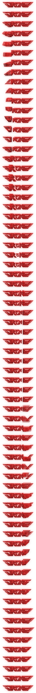 inside a sentence, with text after.


![reference image][logo-ref]


[](https://example.com)

## Autolinks

<https://example.com/path?query=1&b=2>

<mail@example.com>

<mailto:someone@example.com>

<not an autolink>

## Raw Inline HTML

Text with <em>raw emphasis</em>, <b>bold</b>, <br> a break tag, <span class="x">span</span>, and <!-- inline comment --> comment.

An unclosed <span tag and a lone < character and a > character.

## Hard and Soft Breaks

Hard break with two trailing spaces  
next line.

Hard break with backslash\
next line.

Soft break
next line.

Trailing backslash at the end of a paragraph\

Spaces at the end of a paragraph  

## Backslash Escapes and Entities

\*not emphasis\* \_not\_ \# not heading \[not link\] \`not code\`

\\ backslash, \! bang, \< less, \> greater, \| pipe, \~ tilde

\a is not an escape

Named &copy; &amp; &lt; &gt; &quot; &nbsp; &hellip; entity.

Decimal &#35; &#9731; and hex &#x1F600; &#xD7; entity.

Invalid &notanentity; &#xZZ; &amp literal.

&copy; at the start of a paragraph.

## Pipe Tables

| Left | Center | Right |
|:-----|:------:|------:|
| a | b | c |
| longer left | longer center | longer right |
| `code` | **bold** | [link](https://example.com) |

Header | Without | Outer Pipes
--- | --- | ---
1 | 2 | 3
4 | 5

| Escaped \| pipe | Empty |
|---|---|
| x \| y | |
| | z |

| Only header |
|---|

## Strikethrough

~one~ tilde and ~~two~~ tildes

~~strike **with strong** inside~~

Inline ~~~three~~~ tildes is not strikethrough

~ lone tilde ~ and ~~ spaced ~~

## Task Lists

- [ ] open task
- [x] done task
- [X] done upper case
- [ ] task with **bold** and `code`
  - [x] nested done
  - [ ] nested open

1. [ ] ordered open
2. [x] ordered done

- [] not a task
- [x]not a task either

## Extended Autolinks

Visit www.example.com for details.

Visit https://example.com/path?x=1 today.

Write to someone@example.com please.

Trailing punctuation: https://example.com/path. and (https://example.com/inner) and www.example.com/a_b_c.

## Grid Tables

+-------------+-------------+-------------+
| Header One  | Header Two  | Header Three|
+=============+=============+=============+
| cell a      | cell b      | cell c      |
+-------------+-------------+-------------+
| row two     | multi line  | third       |
|             | cell text   |             |
|             | continues   |             |
+-------------+-------------+-------------+

+-----------+-------------------------+
| Name      | Description             |
+===========+=========================+
| item      | - bullet in cell        |
|           | - second bullet         |
+-----------+-------------------------+
| other     | *emphasis* and `code`   |
+-----------+-------------------------+

## Text Shaping

Emoji: 😀 😂 👍🏽 👨‍👩‍👧 🇮🇩 🇯🇵 ❤️ ✨ 🧑🏿‍💻 1️⃣

CJK: 日本語の文章はここにあります。中文句子也在这里。한국어 문장도 있습니다。

Mixed: latin 日本語 latin 😀 latin العربية עברית देवनागरी

Private Use Area icons: U+E0A0  U+F015  U+E0B0  U+F07B  U+F121  between words.

Combining marks: e◌́ n◌̃ a◌̈ and ligatures: fi fl ffi -> => != <= >= ===

Wide mixed line: ｆｕｌｌｗｉｄｔｈ ＡＢＣ １２３ and halfwidth ｶﾀｶﾅ.

## Long Prose

A terminal emulator draws text on a grid, but a document renderer draws text on a page whose width changes whenever the window is resized. The renderer must break each paragraph into lines that fit the available width, measure every glyph with the font that the style selects, and keep the result stable while the user scrolls. When the width shrinks, words that fitted before must move to the next line, and when it grows, words must flow back. The break positions depend only on the text, the font metrics and the width, so the same input always gives the same lines, and a scroll offset can be turned into a row without any search through the whole document.

Shaping is the step that turns a string of code points into a sequence of glyphs. For plain Latin text the mapping is nearly one to one, but ligatures merge several letters into one glyph, combining marks attach to the base letter that precedes them, and emoji sequences join several code points with zero width joiners into a single picture. A family of three people is one visible symbol made from five code points, and a flag is two regional indicators that must never be split across a line break. A renderer that treats every code point as one cell will draw these sequences as broken fragments, so the segmentation by grapheme cluster has to happen before the line is measured.

Wrapping long prose also tests the cost of the renderer. A page of six hundred words contains roughly four thousand glyphs, and a scroll gesture asks for a new frame every few milliseconds. If every frame measures every word again, the cost grows with the length of the document and the interface stutters. If the measurement happens once when the document is built, and each frame reads the finished rows in place, the cost of a frame depends only on the number of visible rows. This is why the harness keeps one long paragraph in the file: it shows at once whether the row index, the viewport and the glyph cache agree with each other.

Inline structure inside a long paragraph adds another test. A sentence may contain emphasis that begins in one line and ends in the next, a code span whose monospace advance differs from the surrounding proportional text, and a link whose underline must follow the wrapped fragments. The line breaker may split a styled run at a space, but it must never lose the style on the second half. In the same way, a very long word without any space, such as a path or a hash, has no break opportunity, and the renderer must either let it overflow or cut it at the width, but it may never loop for ever trying to find a place to break it.

Selection and search complete the picture. When the user drags the pointer over wrapped text, the renderer maps a position in pixels to a position in the text and highlights a rectangle for each covered line. The mapping must agree with the shaping, so a click on the right half of a wide glyph chooses the position after it and a click on the left half chooses the position before it. A search for a phrase that crosses a line break must still highlight both fragments, and the match must stay in view when the document scrolls to reveal it.

Finally, the tail of the document should end cleanly. The last line of the last paragraph carries no trailing break, the bottom margin keeps the final row away from the edge of the window, and the maximum scroll offset equals the height of the content minus the height of the viewport. If the content is shorter than the viewport, the offset stays at zero. These small rules are easy to get wrong by one row, which is the reason the long paragraph sits beside the diagrams: both reach the end of the scroll range and both must stop at exactly the same place.

A very long word without any break opportunity: supercalifragilisticexpialidocious_supercalifragilisticexpialidocious_supercalifragilisticexpialidocious_/Users/someone/Documents/Poems/dev/eve/markdown/markdown.md

# Mermaid

## 00 — info

```mermaid
info
```

## 01 — pie

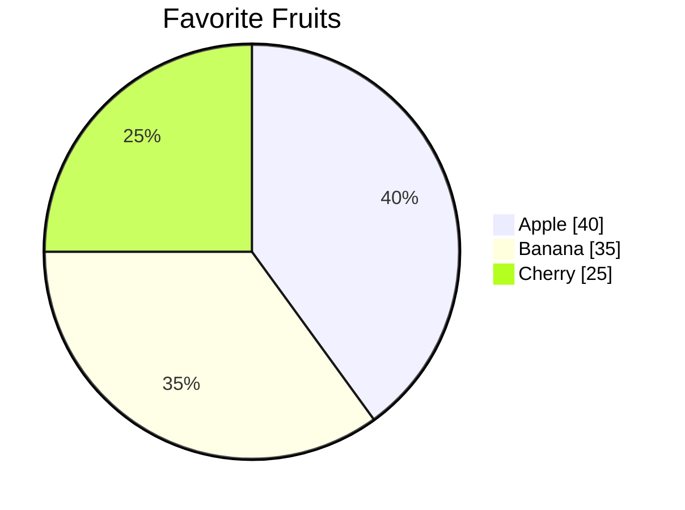

## 02 — packet

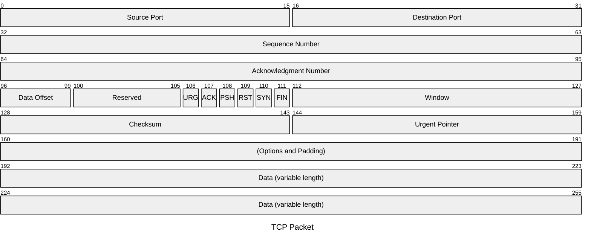

## 03 — packet-beta

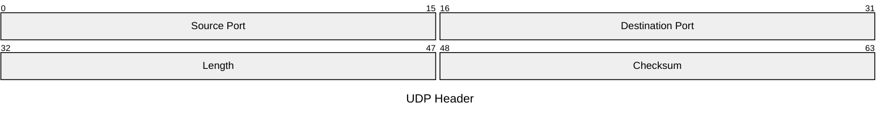

## 04 — xychart

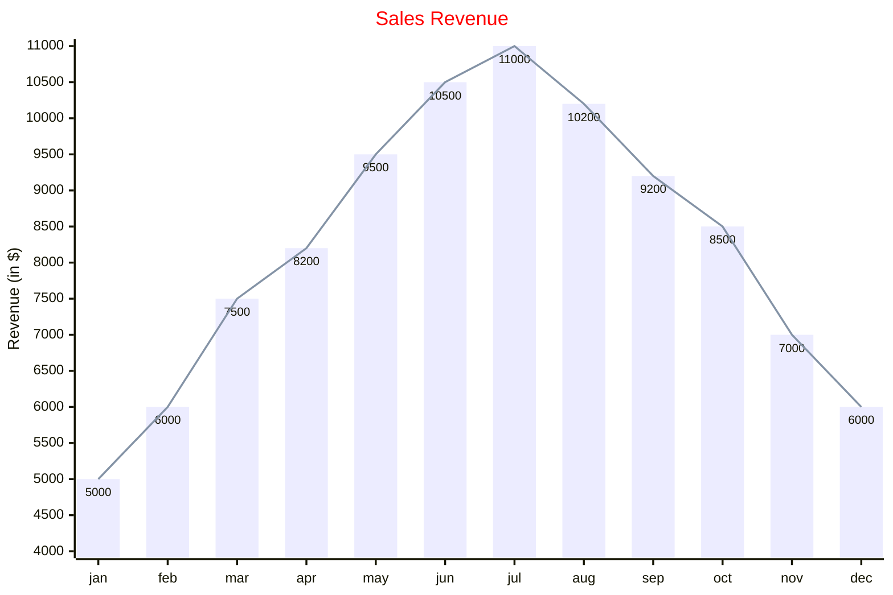

## 05 — xychart-beta

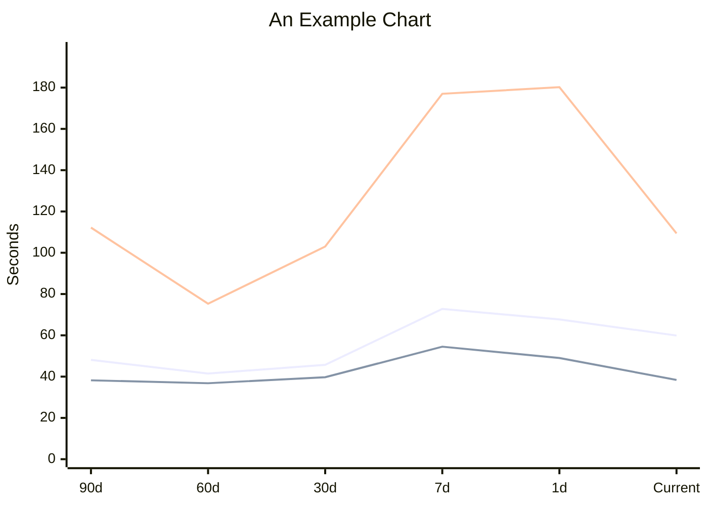

## 06 — radar-beta

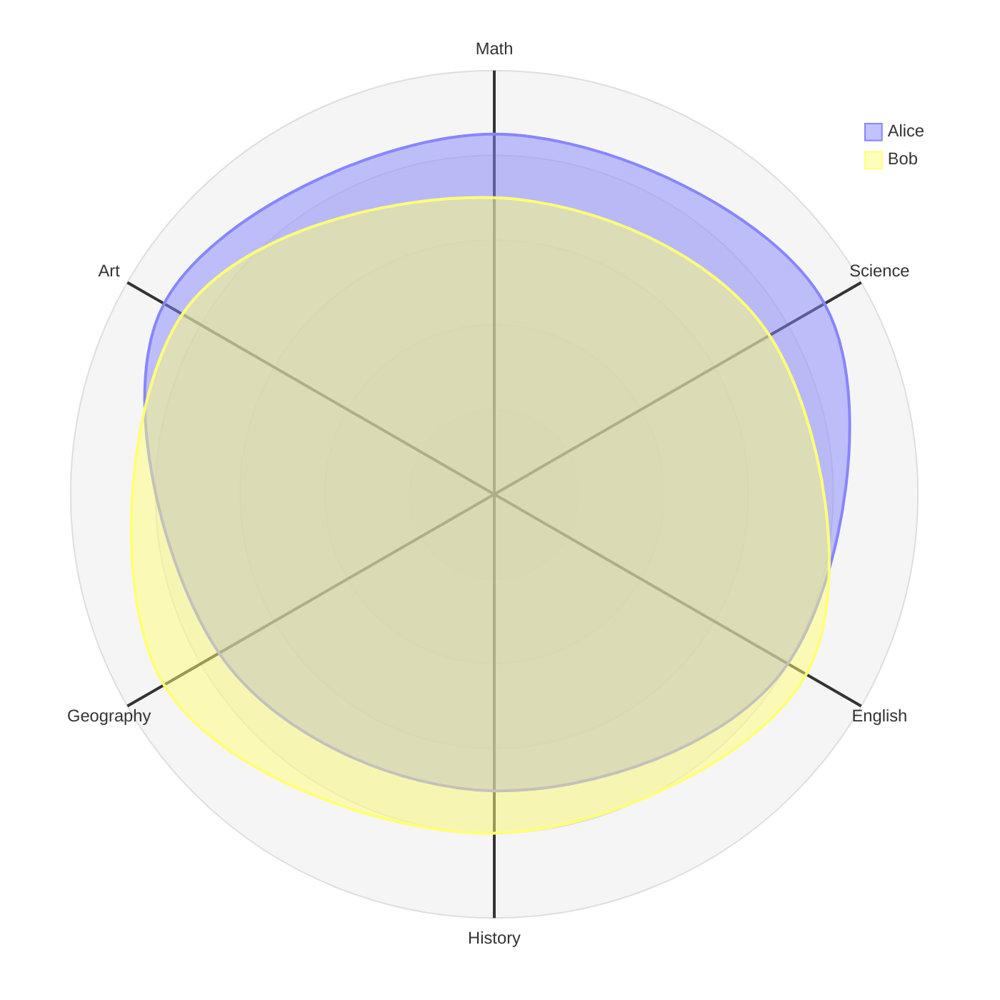

## 07 — venn-beta

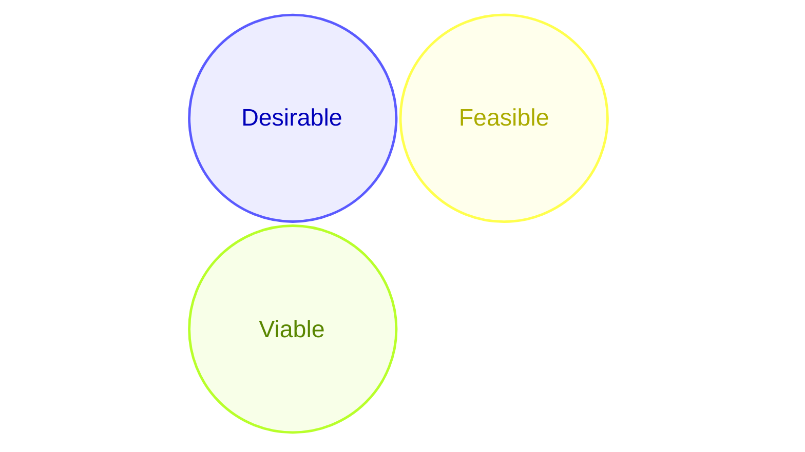

## 08 — quadrantChart

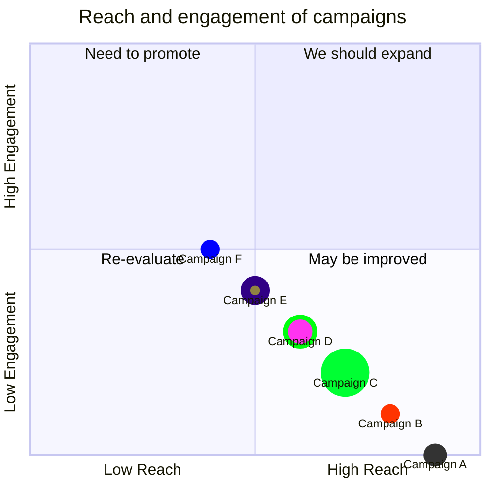

## 09 — timeline

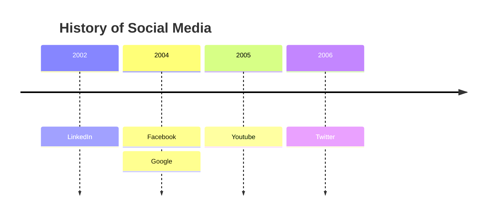

## 10 — journey

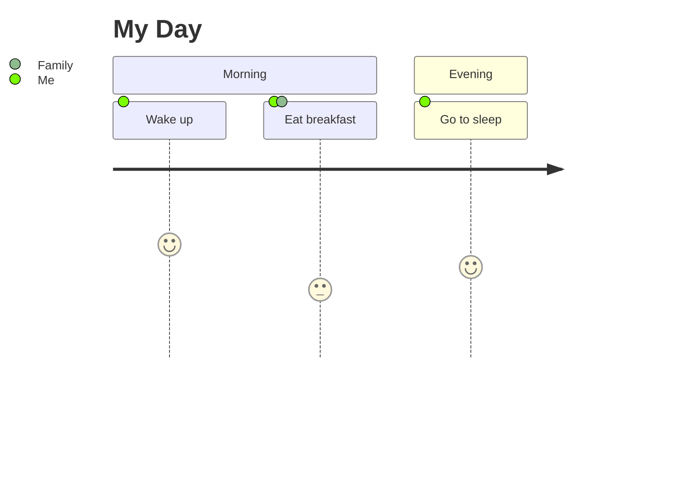

## 11 — gantt

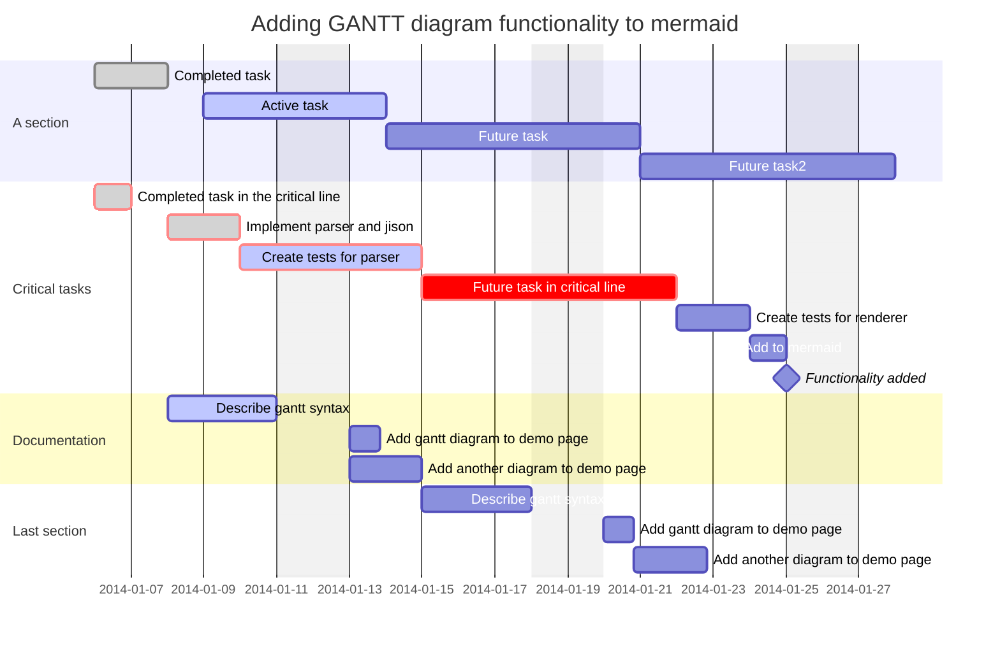

## 12 — kanban

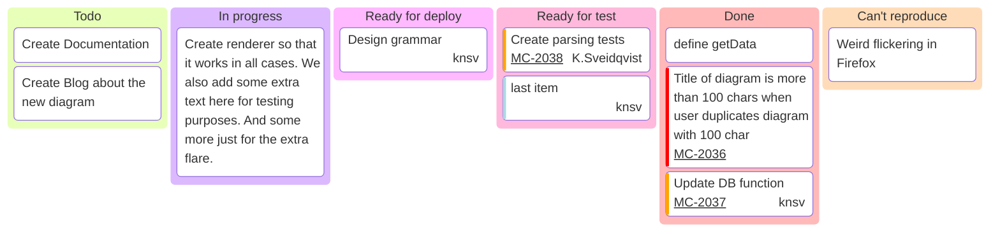

## 13 — treeView-beta


## 14 — cynefin-beta

```mermaid
cynefin-beta
  title Strategy Categorization

  complex
    "Market research"

  complicated
    "Competitive analysis"

  clear
    "Standard pricing"

  chaotic
    "Crisis management"

  complex --> complicated : "Pattern identified"
  complicated --> clear : "Best practice codified"
  clear --> chaotic : "Complacency"
  chaotic --> complex : "Stabilized"

```

## 15 — treemap-beta

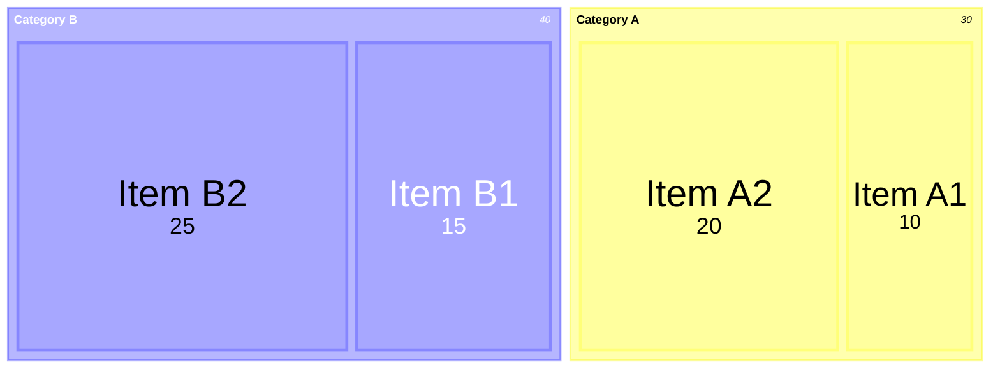

## 16 — mindmap

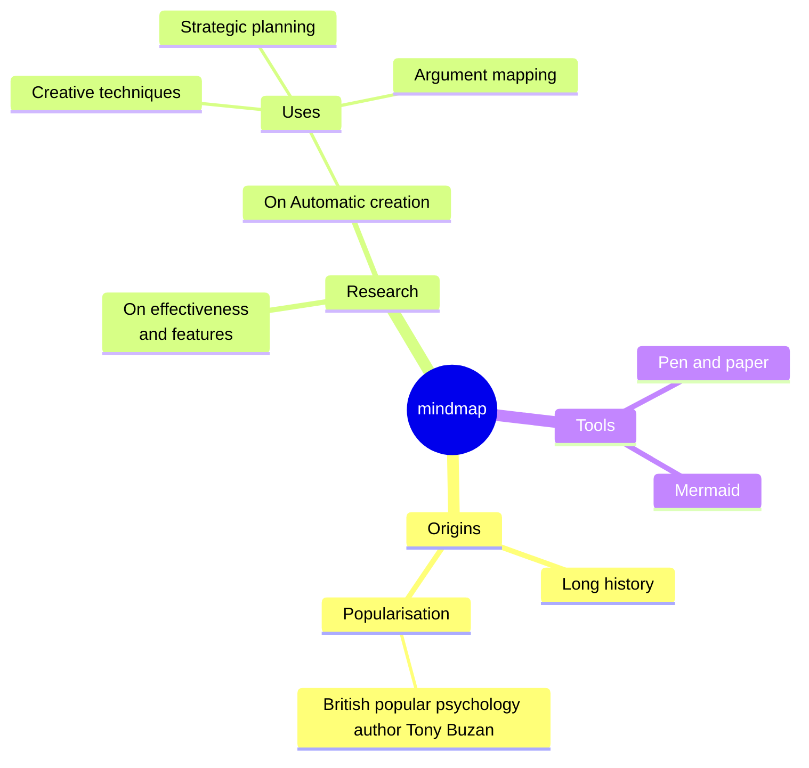

## 17 — ishikawa

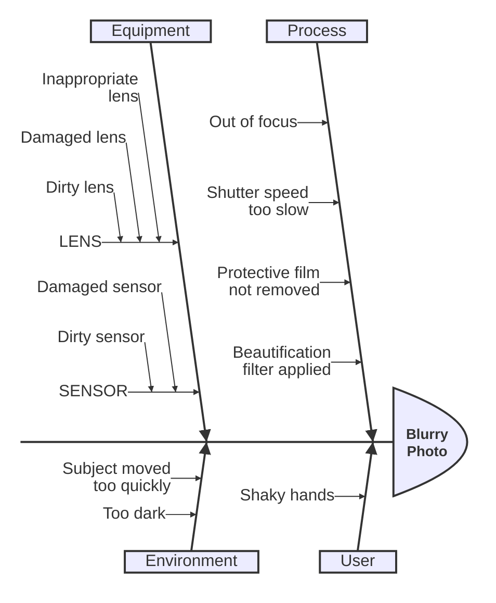

## 18 — wardley-beta

```mermaid
wardley-beta
title Software Platform Strategy
size [1100, 800]

evolution Genesis@0.25 -> Custom@0.5 -> Product@0.75 -> Commodity@1.0

anchor Customer [0.90, 0.95]

component "Mobile App" [0.80, 0.85] (build)
component "Web App" [0.75, 0.80] label [-60, 10] (build)
component "API Gateway" [0.70, 0.65] (buy)
component "Auth Service" [0.60, 0.55] (outsource)
component "Database" [0.50, 0.45] (buy) (inertia)
component "Cloud Platform" [0.30, 0.95] (market)

Customer -> "Mobile App"
Customer -> "Web App"
"Mobile App" -> "API Gateway"
"Web App" -> "API Gateway"
"API Gateway" -> "Auth Service"
"API Gateway" -> "Database"
"Database" -> "Cloud Platform"

evolve "API Gateway" 0.85
evolve "Database" 0.75

accelerator "Cloud Native" [0.20, 0.85]
deaccelerator "Legacy Data" [0.45, 0.35]

annotations [0.10, 0.20]
annotation 1,[0.78, 0.82] "User touchpoints"
annotation 2,[0.70, 0.60] "Integration layer"
annotation 3,[0.50, 0.40] "Data persistence"

note "Build mobile-first experience" [0.85, 0.90]
note "Migrate to cloud-native database" [0.60, 0.50]

```

## 19 — erDiagram

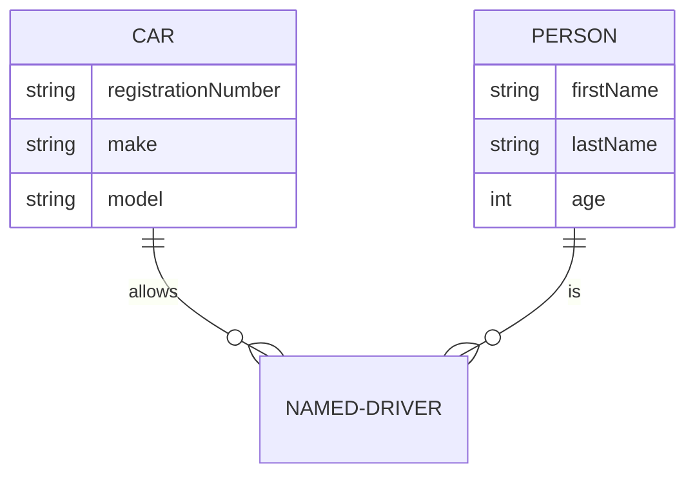

## 20 — stateDiagram

```mermaid
---
title: Simple sample
---
stateDiagram
    [*] --> Still
    Still --> [*]

    Still --> Moving
    Moving --> Still
    Moving --> Crash
    Crash --> [*]

```

## 21 — stateDiagram-v2

```mermaid
stateDiagram-v2
    [*] --> First
    state First {
        [*] --> second
        second --> [*]
    }

    [*] --> NamedComposite
    NamedComposite: Another Composite
    state NamedComposite {
        [*] --> namedSimple
        namedSimple --> [*]
        namedSimple: Another simple
    }

```

## 22 — classDiagram

```mermaid
classDiagram
    class Animal {
        +String name
        +makeSound()
    }
    class Dog
    Animal <|-- Dog
```

## 23 — classDiagram-v2

```mermaid
classDiagram-v2

classA -- classB : Inheritance
classA -- classC : link
classC -- classD : link
classB -- classD
```

## 24 — requirementDiagram

```mermaid
requirementDiagram

requirement test_req {
id: 1
text: the test text.
risk: high
verifymethod: test
}

functionalRequirement test_req2 {
id: 1.1
text: the second test text.
risk: low
verifymethod: inspection
}

performanceRequirement test_req3 {
id: 1.2
text: the third test text.
risk: medium
verifymethod: demonstration
}

interfaceRequirement test_req4 {
id: 1.2.1
text: the fourth test text.
risk: medium
verifymethod: analysis
}

physicalRequirement test_req5 {
id: 1.2.2
text: the fifth test text.
risk: medium
verifymethod: analysis
}

designConstraint test_req6 {
id: 1.2.3
text: the sixth test text.
risk: medium
verifymethod: analysis
}

element test_entity {
type: simulation
}

element test_entity2 {
type: word doc
docRef: reqs/test_entity
}

element test_entity3 {
type: "test suite"
docRef: github.com/all_the_tests
}


test_entity - satisfies -> test_req2
test_req - traces -> test_req2
test_req - contains -> test_req3
test_req3 - contains -> test_req4
test_req4 - derives -> test_req5
test_req5 - refines -> test_req6
test_entity3 - verifies -> test_req5
test_req <- copies - test_entity2
```

## 25 — graph

```mermaid
graph TD
    A[Start] --> B{Decision}
    B -->|Yes| C[Process]
    B -->|No| D[End]
    subgraph Cluster
        C --> E[Finish]
    end
```

## 26 — flowchart

```mermaid
flowchart TB
    c1-->a2
    subgraph one
    a1-->a2
    end
    subgraph two
    b1-->b2
    end
    subgraph three
    c1-->c2
    end

```

## 27 — flowchart-elk

```mermaid
flowchart-elk TD
      A[Christmas] -->|Get money| B(Go shopping)
      B --> C{Let me think}
      C -->|One| D[Laptop]
      C -->|Two| E[iPhone]
      C -->|Three| F[fa:fa-car Car]
```

## 28 — block

```mermaid
block
columns 1
  db(("DB"))
  blockArrowId6<["&nbsp;&nbsp;&nbsp;"]>(down)
  block:ID
    A
    B["A wide one in the middle"]
    C
  end
  space
  D
  ID --> D
  C --> D
  style B fill:#939,stroke:#333,stroke-width:4px

```

## 29 — block-beta

```mermaid
block-beta
  columns 2
  block
    id2["I am a wide one"]
    id1
  end
  id["Next row"]
```

## 30 — architecture-beta

```mermaid
architecture-beta
    service left_disk(disk)[Disk]
    service top_disk(disk)[Disk]
    service bottom_disk(disk)[Disk]
    service top_gateway(internet)[Gateway]
    service bottom_gateway(internet)[Gateway]
    junction junctionCenter
    junction junctionRight

    left_disk:R -- L:junctionCenter
    top_disk:B -- T:junctionCenter
    bottom_disk:T -- B:junctionCenter
    junctionCenter:R -- L:junctionRight
    top_gateway:B -- T:junctionRight
    bottom_gateway:T -- B:junctionRight

```

## 31 — gitGraph

```mermaid
    gitGraph
       commit id: "1"
       commit id: "2"
       branch nice_feature
       checkout nice_feature
       commit id: "3"
       checkout main
       commit id: "4"
       checkout nice_feature
       branch very_nice_feature
       checkout very_nice_feature
       commit id: "5"
       checkout main
       commit id: "6"
       checkout nice_feature
       commit id: "7"
       checkout main
       merge nice_feature id: "customID" tag: "customTag" type: REVERSE
       checkout very_nice_feature
       commit id: "8"
       checkout main
       commit id: "9"

```

## 32 — sankey

```mermaid
---
config:
  sankey:
    showValues: false
---
sankey

Agricultural 'waste',Bio-conversion,124.729
Bio-conversion,Liquid,0.597
Bio-conversion,Losses,26.862
Bio-conversion,Solid,280.322
Bio-conversion,Gas,81.144
Biofuel imports,Liquid,35
Biomass imports,Solid,35
Coal imports,Coal,11.606
Coal reserves,Coal,63.965
Coal,Solid,75.571
District heating,Industry,10.639
District heating,Heating and cooling - commercial,22.505
District heating,Heating and cooling - homes,46.184
Electricity grid,Over generation / exports,104.453
Electricity grid,Heating and cooling - homes,113.726
Electricity grid,H2 conversion,27.14
Electricity grid,Industry,342.165
Electricity grid,Road transport,37.797
Electricity grid,Agriculture,4.412
Electricity grid,Heating and cooling - commercial,40.858
Electricity grid,Losses,56.691
Electricity grid,Rail transport,7.863
Electricity grid,Lighting & appliances - commercial,90.008
Electricity grid,Lighting & appliances - homes,93.494
Gas imports,Ngas,40.719
Gas reserves,Ngas,82.233
Gas,Heating and cooling - commercial,0.129
Gas,Losses,1.401
Gas,Thermal generation,151.891
Gas,Agriculture,2.096
Gas,Industry,48.58
Geothermal,Electricity grid,7.013
H2 conversion,H2,20.897
H2 conversion,Losses,6.242
H2,Road transport,20.897
Hydro,Electricity grid,6.995
Liquid,Industry,121.066
Liquid,International shipping,128.69
Liquid,Road transport,135.835
Liquid,Domestic aviation,14.458
Liquid,International aviation,206.267
Liquid,Agriculture,3.64
Liquid,National navigation,33.218
Liquid,Rail transport,4.413
Marine algae,Bio-conversion,4.375
Ngas,Gas,122.952
Nuclear,Thermal generation,839.978
Oil imports,Oil,504.287
Oil reserves,Oil,107.703
Oil,Liquid,611.99
Other waste,Solid,56.587
Other waste,Bio-conversion,77.81
Pumped heat,Heating and cooling - homes,193.026
Pumped heat,Heating and cooling - commercial,70.672
Solar PV,Electricity grid,59.901
Solar Thermal,Heating and cooling - homes,19.263
Solar,Solar Thermal,19.263
Solar,Solar PV,59.901
Solid,Agriculture,0.882
Solid,Thermal generation,400.12
Solid,Industry,46.477
Thermal generation,Electricity grid,525.531
Thermal generation,Losses,787.129
Thermal generation,District heating,79.329
Tidal,Electricity grid,9.452
UK land based bioenergy,Bio-conversion,182.01
Wave,Electricity grid,19.013
Wind,Electricity grid,289.366

```

## 33 — sankey-beta

```mermaid
sankey-beta

sourceNode,targetNode,10
```

## 34 — sequenceDiagram

```mermaid
sequenceDiagram
    participant Alice
    participant Bob
    Alice->>Bob: Hello Bob
    activate Bob
    Bob-->>Alice: Hi Alice
    deactivate Bob
    Note over Alice,Bob: They greeted each other
```

## 35 — swimlane-beta

```mermaid
swimlane-beta LR
  subgraph Intake
    start([Start])
    task[Do work]
    fix[Fix issues]
  end

  subgraph Review
    decision{Ready?}
  end

  subgraph Complete
    done((Done))
  end

  start --> task --> decision
  decision -->|Yes| done
  decision -->|No| fix
  fix --> task

```

## 36 — eventmodeling

```mermaid
eventmodeling

timeframe 01 ui CartUI
timeframe 02 command AddItem
timeframe 03 event ItemAdded

resetframe 04 event External.InventoryChanged
timeframe 05 processor InventoryProcessor
timeframe 06 command ChangeInventory
timeframe 07 event Cart.InventoryChanged

rf 02 evt CartCreated
rf 03 evt ItemAdded
rf 04 evt ItemRemoved
rf 05 evt CartCleared
tf 01 rmo CartUI ->> 02 ->> 03 ->> 04 ->> 05

```

## 37 — railroad-beta

```mermaid
railroad-beta
title Expression Grammar

expression = sequence(
    nonterminal("term"),
    zeroOrMore(sequence(
        choice(terminal("+"), terminal("-")),
        nonterminal("term")
    ))
) ;
term = sequence(
    nonterminal("factor"),
    zeroOrMore(sequence(
        choice(terminal("*"), terminal("/")),
        nonterminal("factor")
    ))
) ;
factor = choice(
    nonterminal("number"),
    sequence(terminal("("), nonterminal("expression"), terminal(")"))
) ;
number = oneOrMore(nonterminal("digit")) ;
digit = choice(terminal("0"), terminal("1"), terminal("2"), terminal("3"), terminal("4"), terminal("5"), terminal("6"), terminal("7"), terminal("8"), terminal("9")) ;
```

## 38 — railroad-ebnf-beta

```mermaid
railroad-ebnf-beta
title "Digit Definition"

digit = "0" | "1" | "2" | "3" | "4" | "5" | "6" | "7" | "8" | "9" ;
```

## 39 — railroad-abnf-beta

```mermaid
railroad-abnf-beta
title "Email Address"

address = local-part "@" domain ;
local-part = 1*( ALPHA / DIGIT / "." / "-" ) ;
domain = label *( "." label ) ;
label = 1*( ALPHA / DIGIT / "-" ) ;
```

## 40 — railroad-peg-beta

```mermaid
railroad-peg-beta
title "Identifiers (keywords excluded)"

Identifier <- !Keyword Letter Letter* ;
Keyword <- "if" / "else" / "while" ;
Letter <- "a" / "b" / "c" / "_" ;
```

## 41 — C4Context

```mermaid
    C4Context
      title System Context diagram for Internet Banking System
      Enterprise_Boundary(b0, "BankBoundary0") {
        Person(customerA, "Banking Customer A", "A customer of the bank, with personal bank accounts.")
        Person(customerB, "Banking Customer B")
        Person_Ext(customerC, "Banking Customer C", "desc")

        Person(customerD, "Banking Customer D", "A customer of the bank, <br/> with personal bank accounts.")

        System(SystemAA, "Internet Banking System", "Allows customers to view information about their bank accounts, and make payments.")

        Enterprise_Boundary(b1, "BankBoundary") {

          SystemDb_Ext(SystemE, "Mainframe Banking System", "Stores all of the core banking information about customers, accounts, transactions, etc.")

          System_Boundary(b2, "BankBoundary2") {
            System(SystemA, "Banking System A")
            System(SystemB, "Banking System B", "A system of the bank, with personal bank accounts. next line.")
          }

          System_Ext(SystemC, "E-mail system", "The internal Microsoft Exchange e-mail system.")
          SystemDb(SystemD, "Banking System D Database", "A system of the bank, with personal bank accounts.")

          Boundary(b3, "BankBoundary3", "boundary") {
            SystemQueue(SystemF, "Banking System F Queue", "A system of the bank.")
            SystemQueue_Ext(SystemG, "Banking System G Queue", "A system of the bank, with personal bank accounts.")
          }
        }
      }

      BiRel(customerA, SystemAA, "Uses")
      BiRel(SystemAA, SystemE, "Uses")
      Rel(SystemAA, SystemC, "Sends e-mails", "SMTP")
      Rel(SystemC, customerA, "Sends e-mails to")

      UpdateElementStyle(customerA, $fontColor="red", $bgColor="grey", $borderColor="red")
      UpdateRelStyle(customerA, SystemAA, $textColor="blue", $lineColor="blue", $offsetX="5")
      UpdateRelStyle(SystemAA, SystemE, $textColor="blue", $lineColor="blue", $offsetY="-10")
      UpdateRelStyle(SystemAA, SystemC, $textColor="blue", $lineColor="blue", $offsetY="-40", $offsetX="-50")
      UpdateRelStyle(SystemC, customerA, $textColor="red", $lineColor="red", $offsetX="-50", $offsetY="20")

      UpdateLayoutConfig($c4ShapeInRow="3", $c4BoundaryInRow="1")


```

## 42 — C4Container

```mermaid
    C4Container
    title Container diagram for Internet Banking System

    System_Ext(email_system, "E-Mail System", "The internal Microsoft Exchange system", $tags="v1.0")
    Person(customer, Customer, "A customer of the bank, with personal bank accounts", $tags="v1.0")

    Container_Boundary(c1, "Internet Banking") {
        Container(spa, "Single-Page App", "JavaScript, Angular", "Provides all the Internet banking functionality to customers via their web browser")
        Container_Ext(mobile_app, "Mobile App", "C#, Xamarin", "Provides a limited subset of the Internet banking functionality to customers via their mobile device")
        Container(web_app, "Web Application", "Java, Spring MVC", "Delivers the static content and the Internet banking SPA")
        ContainerDb(database, "Database", "SQL Database", "Stores user registration information, hashed auth credentials, access logs, etc.")
        ContainerDb_Ext(backend_api, "API Application", "Java, Docker Container", "Provides Internet banking functionality via API")

    }

    System_Ext(banking_system, "Mainframe Banking System", "Stores all of the core banking information about customers, accounts, transactions, etc.")

    Rel(customer, web_app, "Uses", "HTTPS")
    UpdateRelStyle(customer, web_app, $offsetY="60", $offsetX="90")
    Rel(customer, spa, "Uses", "HTTPS")
    UpdateRelStyle(customer, spa, $offsetY="-40")
    Rel(customer, mobile_app, "Uses")
    UpdateRelStyle(customer, mobile_app, $offsetY="-30")

    Rel(web_app, spa, "Delivers")
    UpdateRelStyle(web_app, spa, $offsetX="130")
    Rel(spa, backend_api, "Uses", "async, JSON/HTTPS")
    Rel(mobile_app, backend_api, "Uses", "async, JSON/HTTPS")
    Rel_Back(database, backend_api, "Reads from and writes to", "sync, JDBC")

    Rel(email_system, customer, "Sends e-mails to")
    UpdateRelStyle(email_system, customer, $offsetX="-45")
    Rel(backend_api, email_system, "Sends e-mails using", "sync, SMTP")
    UpdateRelStyle(backend_api, email_system, $offsetY="-60")
    Rel(backend_api, banking_system, "Uses", "sync/async, XML/HTTPS")
    UpdateRelStyle(backend_api, banking_system, $offsetY="-50", $offsetX="-140")


```

## 43 — C4Component

```mermaid
    C4Component
    title Component diagram for Internet Banking System - API Application

    Container(spa, "Single Page Application", "javascript and angular", "Provides all the internet banking functionality to customers via their web browser.")
    Container(ma, "Mobile App", "Xamarin", "Provides a limited subset to the internet banking functionality to customers via their mobile device.")
    ContainerDb(db, "Database", "Relational Database Schema", "Stores user registration information, hashed authentication credentials, access logs, etc.")
    System_Ext(mbs, "Mainframe Banking System", "Stores all of the core banking information about customers, accounts, transactions, etc.")

    Container_Boundary(api, "API Application") {
        Component(sign, "Sign In Controller", "MVC Rest Controller", "Allows users to sign in to the internet banking system")
        Component(accounts, "Accounts Summary Controller", "MVC Rest Controller", "Provides customers with a summary of their bank accounts")
        Component(security, "Security Component", "Spring Bean", "Provides functionality related to singing in, changing passwords, etc.")
        Component(mbsfacade, "Mainframe Banking System Facade", "Spring Bean", "A facade onto the mainframe banking system.")

        Rel(sign, security, "Uses")
        Rel(accounts, mbsfacade, "Uses")
        Rel(security, db, "Read & write to", "JDBC")
        Rel(mbsfacade, mbs, "Uses", "XML/HTTPS")
    }

    Rel_Back(spa, sign, "Uses", "JSON/HTTPS")
    Rel(spa, accounts, "Uses", "JSON/HTTPS")

    Rel(ma, sign, "Uses", "JSON/HTTPS")
    Rel(ma, accounts, "Uses", "JSON/HTTPS")

    UpdateRelStyle(spa, sign, $offsetY="-40")
    UpdateRelStyle(spa, accounts, $offsetX="40", $offsetY="40")

    UpdateRelStyle(ma, sign, $offsetX="-90", $offsetY="40")
    UpdateRelStyle(ma, accounts, $offsetY="-40")

        UpdateRelStyle(sign, security, $offsetX="-160", $offsetY="10")
        UpdateRelStyle(accounts, mbsfacade, $offsetX="140", $offsetY="10")
        UpdateRelStyle(security, db, $offsetY="-40")
        UpdateRelStyle(mbsfacade, mbs, $offsetY="-40")


```

## 44 — C4Dynamic

```mermaid
    C4Dynamic
    title Dynamic diagram for Internet Banking System - API Application

    ContainerDb(c4, "Database", "Relational Database Schema", "Stores user registration information, hashed authentication credentials, access logs, etc.")
    Container(c1, "Single-Page Application", "JavaScript and Angular", "Provides all of the Internet banking functionality to customers via their web browser.")
    Container_Boundary(b, "API Application") {
      Component(c3, "Security Component", "Spring Bean", "Provides functionality Related to signing in, changing passwords, etc.")
      Component(c2, "Sign In Controller", "Spring MVC Rest Controller", "Allows users to sign in to the Internet Banking System.")
    }
    Rel(c1, c2, "Submits credentials to", "JSON/HTTPS")
    Rel(c2, c3, "Calls isAuthenticated() on")
    Rel(c3, c4, "select * from users where username = ?", "JDBC")

    UpdateRelStyle(c1, c2, $textColor="red", $offsetY="-40")
    UpdateRelStyle(c2, c3, $textColor="red", $offsetX="-40", $offsetY="60")
    UpdateRelStyle(c3, c4, $textColor="red", $offsetY="-40", $offsetX="10")


```

## 45 — C4Deployment

```mermaid
    C4Deployment
    title Deployment Diagram for Internet Banking System - Live

    Deployment_Node(mob, "Customer's mobile device", "Apple IOS or Android"){
        Container(mobile, "Mobile App", "Xamarin", "Provides a limited subset of the Internet Banking functionality to customers via their mobile device.")
    }

    Deployment_Node(comp, "Customer's computer", "Microsoft Windows or Apple macOS"){
        Deployment_Node(browser, "Web Browser", "Google Chrome, Mozilla Firefox,<br/> Apple Safari or Microsoft Edge"){
            Container(spa, "Single Page Application", "JavaScript and Angular", "Provides all of the Internet Banking functionality to customers via their web browser.")
        }
    }

    Deployment_Node(plc, "Big Bank plc", "Big Bank plc data center"){
        Deployment_Node(dn, "bigbank-api*** x8", "Ubuntu 16.04 LTS"){
            Deployment_Node(apache, "Apache Tomcat", "Apache Tomcat 8.x"){
                Container(api, "API Application", "Java and Spring MVC", "Provides Internet Banking functionality via a JSON/HTTPS API.")
            }
        }
        Deployment_Node(bb2, "bigbank-web*** x4", "Ubuntu 16.04 LTS"){
            Deployment_Node(apache2, "Apache Tomcat", "Apache Tomcat 8.x"){
                Container(web, "Web Application", "Java and Spring MVC", "Delivers the static content and the Internet Banking single page application.")
            }
        }
        Deployment_Node(bigbankdb01, "bigbank-db01", "Ubuntu 16.04 LTS"){
            Deployment_Node(oracle, "Oracle - Primary", "Oracle 12c"){
                ContainerDb(db, "Database", "Relational Database Schema", "Stores user registration information, hashed authentication credentials, access logs, etc.")
            }
        }
        Deployment_Node(bigbankdb02, "bigbank-db02", "Ubuntu 16.04 LTS") {
            Deployment_Node(oracle2, "Oracle - Secondary", "Oracle 12c") {
                ContainerDb(db2, "Database", "Relational Database Schema", "Stores user registration information, hashed authentication credentials, access logs, etc.")
            }
        }
    }

    Rel(mobile, api, "Makes API calls to", "json/HTTPS")
    Rel(spa, api, "Makes API calls to", "json/HTTPS")
    Rel_U(web, spa, "Delivers to the customer's web browser")
    Rel(api, db, "Reads from and writes to", "JDBC")
    Rel(api, db2, "Reads from and writes to", "JDBC")
    Rel_R(db, db2, "Replicates data to")

    UpdateRelStyle(spa, api, $offsetY="-40")
    UpdateRelStyle(web, spa, $offsetY="-40")
    UpdateRelStyle(api, db, $offsetY="-20", $offsetX="5")
    UpdateRelStyle(api, db2, $offsetX="-40", $offsetY="-20")
    UpdateRelStyle(db, db2, $offsetY="-10")


```
